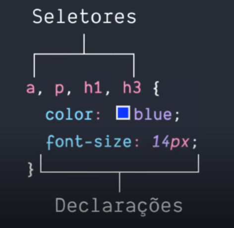

# CSS 3

## Definição e seletores

Após a criação do HTML a necessidade de formatar as páginas ficou evidente, assim, em 1996, foi criada a linguagem de estilo que conhecemos por CSS.

A sintaxe é bem simples e pode ser explicada com a frase "você cria regras de estilo para elementos ou grupos de elementos".

  

## ID x Classe

Criar uma regra que altera um elemento HTML diretamente significa que todos os elementos daquele tipo ficarão com aquela aparência e normalmente temos sites mais complexos que precisam de várias regras diferentes para elementos iguais.
É aí que entram os IDs e Classes.

ID: é representado pelo símbolo # (hash) seguido de um nome para esse ID.

Classe: a classe é representada de forma parecida do ID, mas é precedida por um ponto em vez do hash.

E a diferença mais importante entre eles é a forma como devem ser usados: o ID só pode ser usado uma vez em uma página HTML enquanto a classe não tem restrições.

## Box-model
Quando estamos criando o layout de um site o navegador representa cada elemento HTML  como uma caixa retangular, isso é o box-model. E com CSS nós alteramos a aparência dessa caixa (largura, altura, cor de fundo, etc.). Essa caixa é composta por 4 áreas: o conteúdo, o padding, a borda e a margem.

   

 - As margens (margin) são espaçamentos entre elementos;
 - As bordas (border) ;
 - O padding é um espaçamento entre as bordas e o conteúdo, a diferença para as margens é que declarações de imagem de fundo funcionam nele;
 - O conteúdo (content) é o que o seu bloco representa, um texto, uma imagem, um vídeo;

 ## Estilizando elementos

 ### Padding e Margin

Podemos usar o  padding e o margin da forma mais básica, com apenas um valor, mas eles são mais poderosos que isso. Se quisermos atribuir tamanhos diferentes para cada lado do box nós podemos, e vamos ver três formas de fazer isso.

A primeira é colocando um valor para as partes superior e inferior e depois para os lados esquerdo e direito.   
   

A segunda forma é dando valores para cada lado do box.
   

A terceira forma é com as propriedades específicas para cada lado.
   

### Background

E aqui temos 3 formas de colocar uma cor de fundo, e ainda existem outras.

   

A primeira é pelo nome da cor em inglês, a segunda é pelo código hexadecimal e a terceira é usando apenas o atalho background.

### Border

Vimos que a propriedade border pode ter 3 valores: a largura, a cor e o estilo, mas existem algumas particularidades nisso.

A largura pode ser usada com várias unidades, como px, em e mm. A cor pode ser atribuída pelo nome ou por um código hexadecimal, assim como fizemos com o background, e o estilo é representada por palavras-chave, vamos ver algumas delas:

    

solid: mostra uma borda simples e reta;

dotted: são bolinhas com um pequeno espaçamento entre elas;

dashed: forma uma linha tracejada.

Border-radius

E a última propriedade é o border-radius, ele permite arredondar os cantos de um elemento. Podemos usar várias unidades, mas as mais comuns são os pixels e a porcentagem.

   

Colocando apenas um valor mudamos todos os cantos do elemento, mas seguindo aquela mesma ordem que vimos no padding e margin - topo, direita, inferior e esquerda -  conseguimos alterar cada canto separadamente.